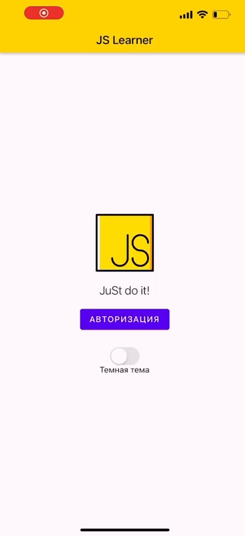

# Reac Native: Мобильное приложение в формате квиза
## Идея:
Приложение в котором можно тренировать вопросы для прохождения собеседований JS. Система квиза с выводом статистики. Авторизация через jwt token github. Встроенный учебник Js для быстрого поиска ответов.

